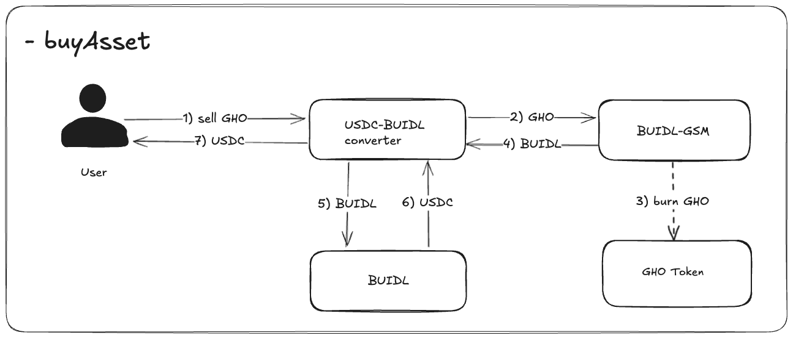

# BUIDL GSM Converter

## Overview

The BUIDL GSM Converter is designed to allow for integration of the GSM ([GHO Stability Module](https://docs.gho.xyz/developer-docs/gho-stability-module)) with [Blackrock BUIDL fund](https://securitize.io/learn/press/blackrock-launches-first-tokenized-fund-buidl-on-the-ethereum-network) subscriptions and redemptions, adhering to the [BUIDL GSM Temp Check](https://governance.aave.com/t/temp-check-buidl-gsm/18775).

The combined BUIDL GSM instance with GsmConverter will enable 1:1 fixed-ratio swaps between USDC and GHO, utilizing the USDC surplus to mint BUIDL tokens. The converter architecture as an intermediary allows for minimal required code changes to the GSM, while also providing a standardized smart contract interface for users. Furthermore, BUIDL holders will be able to interact directly with the BUIDL GSM as they do with other existing GSMs.

### BUIDL GSM ([Gsm.sol](../src/contracts/facilitators/gsm/Gsm.sol))

The BUIDL GSM operates like other existing GSM instances, except it specifically facilitates conversions between GHO and BUIDL. BUIDL holders can interact with this contract directly.

### GSM Converter ([GsmConverter.sol](../src/contracts/facilitators/gsm/converter/GsmConverter.sol))

The GSM Converter will act as a middleware between the user and BUIDL GSM, facilitating conversions between USDC and BUIDL under the hood.

During a `buyAsset` transaction, where users sell GHO to receive USDC, the GsmConverter first interacts with the BUIDL GSM to convert GHO to BUIDL. Then it integrates with the [Circle BUIDL Off-Ramp contract](https://etherscan.io/address/0x31d3f59ad4aac0eee2247c65ebe8bf6e9e470a53#code) in order to redeem USDC in exchange for BUIDL. This USDC is then returned to the user.

During a `sellAsset` transaction, where users sell USDC to receive GHO, ...
